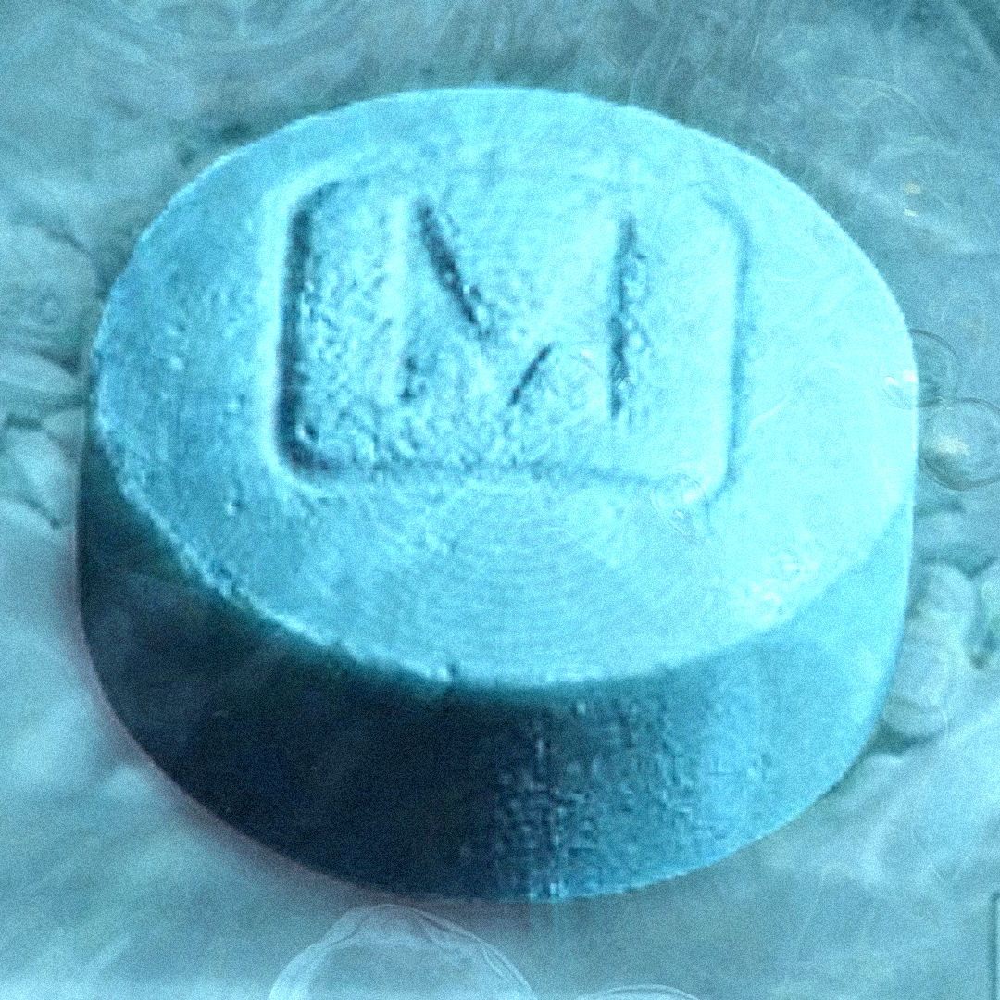

<p align="center">
  
</p>

# Fentware Clips — Local Edition

**Fentware Clips** is a game recording and clipping app for Windows. This repository currently contains the **Local Edition**, focused on recording, replay-buffer clipping, editing, and managing clips entirely on your own machine.

This project is a customized fork of the open-source **Segra** recorder, with Fentware branding and a standalone/local-only focus for the current release.

> **Current status:** early alpha / friends testing. Expect bugs, rough edges, and changes between builds.

> **Online version planned:** this Local Edition is not the final scope of Fentware Clips. A future online-connected version is planned with Fentware-hosted account, sharing, upload, and related online features. Those services are not part of the current build yet.

## Features

- Automatic game detection and background recording
- Replay buffer for saving the last moments with a hotkey
- Up to 4K / high-framerate recording depending on hardware
- H.264, HEVC and AV1 support through supported encoders
- NVIDIA NVENC, AMD AMF, Intel QSV and x264 support
- Multiple audio devices and separate audio tracks
- Microphone noise suppression
- Local clip library
- Clip editor with timeline and audio waveform
- Per-game recording overrides
- Storage limits and automatic cleanup of old recordings
- Local file import and management

## Local Edition

The current Fentware Clips build is intentionally focused on local recording and clip management.

This edition does **not** use Segra.tv accounts, Segra cloud uploads, Discord authentication, or Segra's updater services. Those upstream remote-service paths have been disabled for this standalone fork.

Your recordings and clips are stored on your own machine. The recording directory can be changed from the app settings.

The Local Edition is intended to remain useful on its own, even as online functionality is developed separately.

## Planned Online Edition

A future Fentware Clips online-connected edition is planned. The goal is to add Fentware-owned services around the local recorder rather than reconnecting the application to Segra's hosted services.

Planned online functionality may include:

- Fentware account integration
- Clip uploads to Fentware infrastructure
- Sharing clips through Fentware-hosted services
- Online clip/library features
- Update and release infrastructure owned by Fentware

These features are **planned, not currently available**, and the exact implementation may change during development.

## Download

Prebuilt Windows test builds are published through this repository's **Releases** section when available.

For the current Local Edition friends-testing build:

1. Download the Windows x64 release archive.
2. Extract the full archive to a folder.
3. Run `FentwareClips.exe`.
4. Configure your recording folder, quality, audio devices, and clip hotkey.

Do not move only the `.exe` out of the extracted folder; the application currently ships with additional runtime and native files that it needs beside the executable.

## Building from source

### Requirements

- Windows 10/11 x64
- .NET 10 SDK
- Node.js / npm

Clone the repository, then build from the repository root:

```powershell
dotnet build .\Segra.csproj -f net10.0-windows10.0.19041.0
```

For a self-contained Windows publish build:

```powershell
dotnet publish .\Segra.csproj `
  -c Release `
  -f net10.0-windows10.0.19041.0 `
  -r win-x64 `
  --self-contained true `
  -o .\publish
```

The Windows executable is named:

```text
FentwareClips.exe
```

## Project status

Fentware Clips is currently being separated from Segra's hosted services while keeping the core local recorder, replay buffer, clip editor, game detection, and OBS/libobs recording stack.

The current branch represents the **Local Edition**. Online functionality will be developed around Fentware-owned services later and should not depend on Segra's hosted backend.

Some internal namespaces, filenames, storage identifiers, and development tooling may still use the original `Segra` name. These are being changed only where it is safe to do so without breaking compatibility or existing settings.

## Upstream project and attribution

Fentware Clips is derived from **Segra**, originally developed by [Segergren](https://github.com/Segergren/Segra).

The project continues to use substantial portions of Segra's original source code and architecture. Fentware branding does not remove or replace the original project's copyright or license obligations.

## License

This project is distributed under the **GNU General Public License v2.0 (GPL-2.0)**, consistent with the upstream Segra project.

See [LICENSE](LICENSE) for the full license text.

If you distribute modified builds, the GPL requirements continue to apply, including making the corresponding source code available under the same license.

## Contributing

See [CONTRIBUTING.md](CONTRIBUTING.md) for the existing development setup and project workflow.

Bug reports and testing feedback for the Fentware Clips fork are welcome through this repository.

## Acknowledgments

- **[Segra](https://github.com/Segergren/Segra)** — upstream project and original recorder implementation
- **[OBS Studio](https://obsproject.com)** — recording through libobs
- **[ObsKit.NET](https://github.com/Segergren/ObsKit.NET)** — C# bindings used for libobs integration
- **[FFmpeg](https://github.com/FFmpeg/FFmpeg)** — video and image processing/encoding
- **[Photino.NET](https://github.com/tryphotino/photino.NET)** — desktop application shell

---

**Fentware Clips is not affiliated with or endorsed by the upstream Segra project.**
